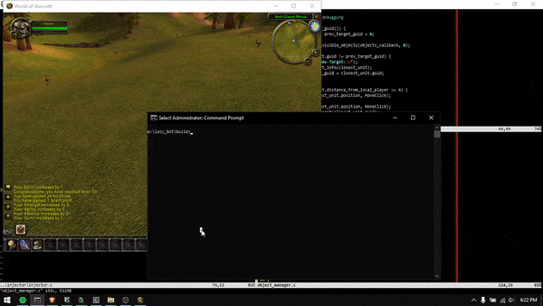

## lazy_bot
A automation tool to play World of Warcraft for me.

### Why?
I'm too damn lazy to even play the game
### How it works?
The bot works by injecting a dll into the game's client, directly calling game's functions and accessing its data structures in memory
### TODO
* Find out a better way to store and iterate over the object manager
* Implement a state machine for the bot's logic
* Improve the bot's combat logic
* Implement fishing
* Implement something to record and load a defined path
* Implement a navigation system, probably using [recastnavigation](https://github.com/recastnavigation/recastnavigation)
* Figure out how to loot enemies
* Implement something to allow the bot's customization
* Hook the graphics api to draw the bot's menu inside the game, probably with [ImGui](https://github.com/ocornut/imgui)
* Figure out how to load the bot at runtime
* Make it look like a real player :v
* Try to make it less detectable in some boring private servers
